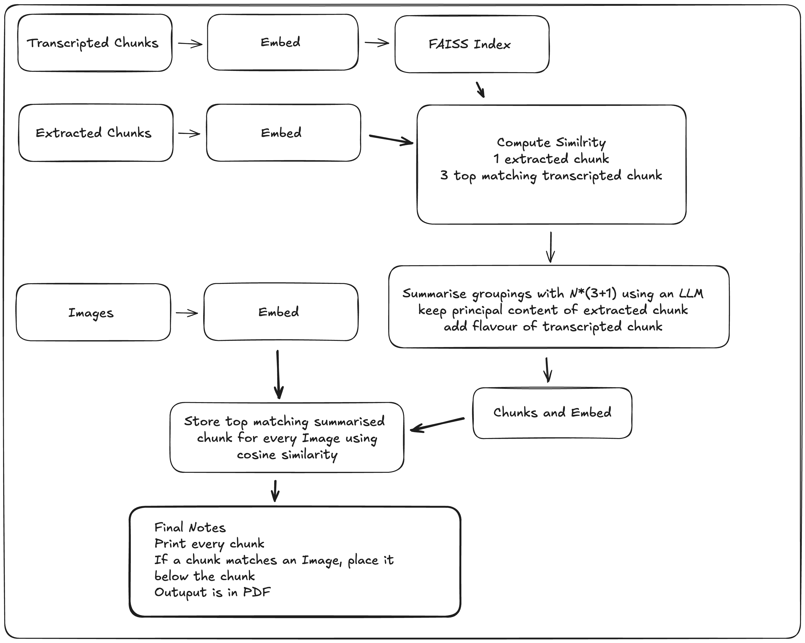

# Tutor

A dockerized multimodal AI system that processes videos and PDFs through an asynchronous Kafka-based architecture. It extracts and embeds audio, text, and image data, computes cross-modal similarity, and generates intelligent summaries aligned with relevant visuals.


## Core Logic: Similarity Matching




## Features

- Microservice Architecture: Each stage is a Kafka-based worker for modular processing.

- Audio Transcription: Uses Whisper to transcribe audio from videos.

- PDF Parsing: Extracts both text and images from uploaded PDFs.

- OpenCLIP Embeddings: Computes unified embeddings for all modalities.

- FAISS Vector Store: Fast local similarity search using FAISS.

- Summarization: Uses LLMs (groq inference) to generate context-aware summaries.

- Similarity Matching: Embeds and aligns PDF text, transcribed text, and images using cosine similarity.


- Fully Dockerized: One command to bring the entire pipeline up and running.

## Docker-Based Kafka Microservices

Each processing unit is a **Kafka consumer/producer pair inside a Docker container**:

```plaintext
+-----------------------+
|  video_to_audio.py    |  <-- consumes videos, produces audio_ready
+-----------------------+
           ↓
+-----------------------+                                                           +-----------------------+
|  audio_transcriber.py |  <-- consumes audio_ready, produces transcription_ready.  |   pdf_extractor.py    |  <-- consumes PDFs, produces pdf_ready
+-----------------------++                                                          +-----------------------+


           ↓                                                                                ↓
            \                                                                              /
             \                                                                            /
              \                                                                          /
+------------------------------+
|     embedding_worker.py      |  <-- consumes transcription_ready & pdf_ready, syncs & embeds
+------------------------------+
              ↓
+------------------------------+
|     local_attention.py       |  <-- consumes embeddings_ready, generates final output
+------------------------------+
```


## Data Placement

Place you pdf with the name `sample.pdf` and video with the name `lecture_sample.mp4` in the data/input directory before running the docker build command

## Environment Variables

To run this project, you will need to add the following environment variables to your docker-compose.yml file

`KAFKA_BROKER: "kafka:9092"`

`GROQ_API_KEY:"XXXXXXX"`

Note: Only GROQ_API_KEY needs to be added KAFKA_BROKER can remain unchanged


## Run Locally

Clone the project

```bash
git clone https://github.com/FreakQnZ/Tutor
```

```bash
cd docker
docker compose up --build
```


Prerequisites: Docker installed

This will spin up:

- Zookeeper

- Kafka

- Streamlit App

- All workers (video, transcription, PDF, embedding, matching)


## Feedback

If you have any feedback, please reach out to me at anuraag.srivatsa123@gmail.com

[](https://anuraagsrivatsa.vercel.app/)
[](https://www.linkedin.com/in/anuraag-srivatsa/)
